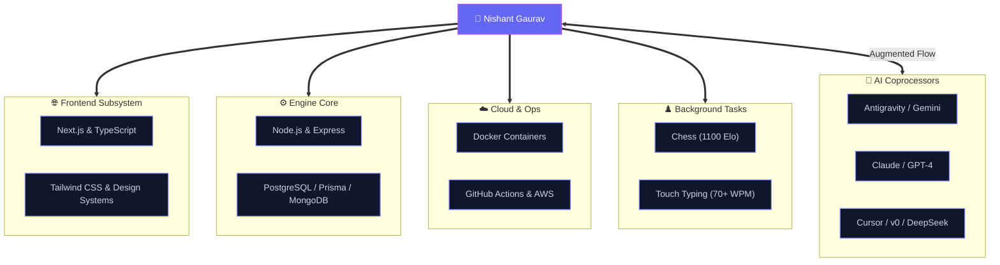

<p align="center">
  
</p>

<p align="center">
  <a href="https://linkedin.com/in/nishantgaurav19" target="_blank"></a>
  <a href="https://twitter.com/imbiberr" target="_blank"></a>
  <a href="https://discord.gg/VtTy2HPR" target="_blank"></a>
  <a href="https://leetcode.com/imbiber/" target="_blank"></a>
  <a href="https://nishant-portfolio-imbiber.vercel.app" target="_blank"></a>
</p>

<p align="center">
  <a href="https://holopin.io/@imbiber" target="_blank">
    
  </a>
  <br>
  <sub style="color: #64748b;">Verified Open Source Badges &amp; Accomplishments</sub>
</p>

---

## 🏗️ System Architecture

A system design overview of how I build, deploy, and interact with technology:



---

### 📜 Career Commit Log (`git log --oneline`)

```git
* 61e8247 (HEAD -> main) feat: master full-stack scaling & Next.js architectures (Present)
* fc770a3 feat: dockerize deployments & build automated CI/CD pipelines (DevOps)
* faf4530 feat: specialize in TypeScript, GraphQL, and modern DB systems (Backend)
* bd9e897 feat: optimize touch typing to 70+ WPM & tactical chess (hobbies)
* 11956a0 init: start coding journey, simplifying complex problems with clean code (init)
```

> 📧 Reachable for collaborations, contracts, or engineering roles at [ng19nishant@gmail.com](mailto:ng19nishant@gmail.com).

---

## 💻 Tech Arsenal

<table>
  <tr>
    <td>
      <b>🧠 Languages &amp; Fundamentals</b><br><br>
      <a href="https://skillicons.dev"></a>
    </td>
  </tr>
  <tr>
    <td>
      <b>🌐 Frontend Frameworks &amp; Styling</b><br><br>
      <a href="https://skillicons.dev"></a>
    </td>
  </tr>
  <tr>
    <td>
      <b>⚙️ Backend, Databases &amp; APIs</b><br><br>
      <a href="https://skillicons.dev"></a>
    </td>
  </tr>
  <tr>
    <td>
      <b>☁️ DevOps, Cloud &amp; Tools</b><br><br>
      <a href="https://skillicons.dev"></a>
    </td>
  </tr>
  <tr>
    <td>
      <b>🤖 AI &amp; Agentic Coding Tools</b><br><br>
      
      
      
      
      
      
      
      
      
    </td>
  </tr>
</table>

---

## 📊 GitHub Diagnostics & Activity

<table width="100%" border="0" cellspacing="0" cellpadding="0">
  <tr valign="top">
    <td width="48%" align="center">
      
    </td>
    <td width="4%"></td>
    <td width="48%" align="center">
      
    </td>
  </tr>
  <tr><td colspan="3"><br></td></tr>
  <tr valign="top">
    <td colspan="3" align="center">
      
    </td>
  </tr>
</table>

---

<table width="100%" border="0" cellspacing="0" cellpadding="0">
  <tr valign="top">
    <td width="48%">
      <h2>✍️ Developer Quote</h2>
      <blockquote>
        “Learning never stops — hackathons, open source, and teamwork are how I grow as a developer.”
      </blockquote>
    </td>
    <td width="4%"></td>
    <td width="48%">
      <h2>😂 Dev Humor</h2>
      <p align="center">
        
      </p>
    </td>
  </tr>
</table>

<p align="center">
  
</p>

---

<p align="center">
  
</p>

<p align="center">
  <em>Crafted with 💖 and precision by Nishant Gaurav</em>
</p>
